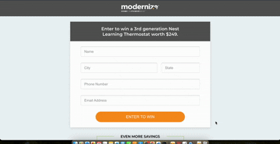

# QuinStreet Application Project

This project is a React application built with TypeScript and Vite that handles form submissions, displays advertorial content for QuinStreet and shows background color transition every 5 secs.

## 📋 Project Overview

This marketing-focused application allows users to:
- Enter personal information (name, city, state, phone, email)
- Submit the form with proper validation
- See appropriate visual feedback during submission
- View advertorial content

## Demo



## Tech Stack

- **React 19** - UI library for building user interfaces
- **TypeScript** - Static type-checking for JavaScript
- **Vite** - Next generation frontend tooling
- **Linaria** - Zero-runtime CSS in JS library
- **React Hook Form** - Performant, flexible form validation
- **Zod** - TypeScript-first schema validation
- **React Toastify** - Toast notifications

## Project Structure

```
quinstreet-app/
├── src/
│   ├── assets/         # Static assets
│   ├── components/     # React components
│   │   ├── Form/
│   │   ├── etc.
│   │   ├── shared/     # shared components
│   ├── App.tsx         # Main App component
│   └── main.tsx        # Application entry point
```


## 🎨 Features

### Form Components
- Responsive form layout
- Custom form inputs with error handling
- Phone number input with automatic formatting
- Validation for all fields with appropriate error messages
- Form submission with timeout handling. Since API doesn't respond, the form
automatically changes text from submitting to submitted

### UI Components
- Animated background color
- Responsive design for mobile and desktop
- Themed button states (normal, submitting, submitted)
- Advertorial section

### Validation Rules
- Name: Required, minimum 2 characters
- City: Optional, allows letters, spaces, hyphens, periods
- State: Optional, validates US state format (2 uppercase letters)
- Phone: Required, US format validation (XXX) XXX-XXXX
- Email: Required, email format validation

### 📱 Responsive Design
The application is fully responsive with specific adjustments for mobile view:
- Custom breakpoint at 767px
- Full-width buttons on mobile
- Font size adjustments
- Spacing optimizations

## Getting Started

### Prerequisites

- Node.js 22.7.0 installed
- npm or yarn package manager

### Installation

```bash
# Install dependencies
npm install

# or with yarn
yarn install
```

### Development

```bash
npm run dev
# or
yarn dev
```

This starts the development server at http://localhost:5173

### Build

```bash
npm run build
# or
yarn build
```

### Linting

```bash
npm run lint
# or
yarn lint
```

## 🖌️ Styling

The project uses Linaria for CSS-in-JS styling with zero runtime cost. Features include:
- Themeable colors and typography
- Consistent styling across components
- Support for dynamic styling based on props
- Media queries for responsive design

The application features a background color transition effect that alternates between two colors.

## Deployment

After building the project, the output in the `dist` directory can be deployed to any static hosting service.

